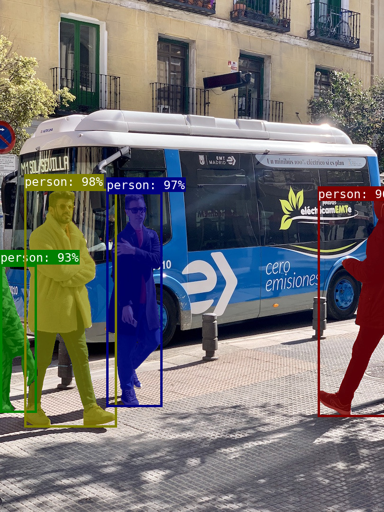
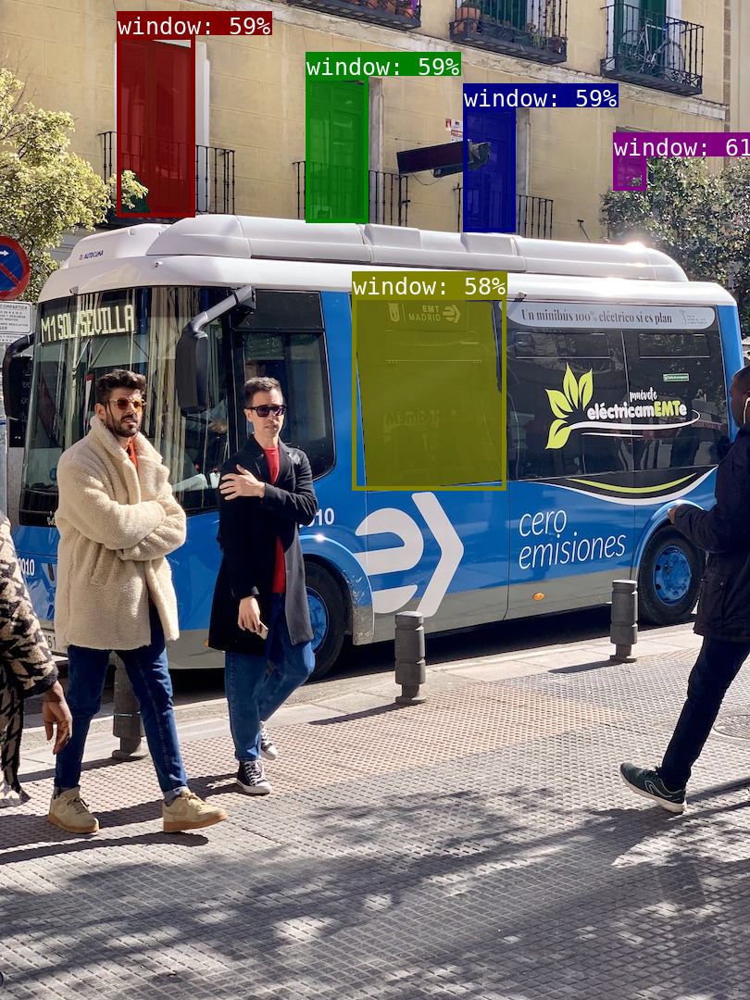
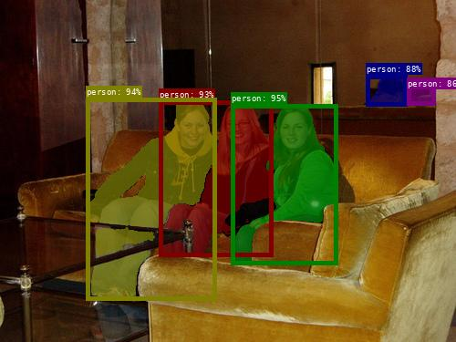
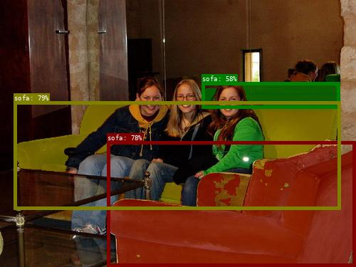
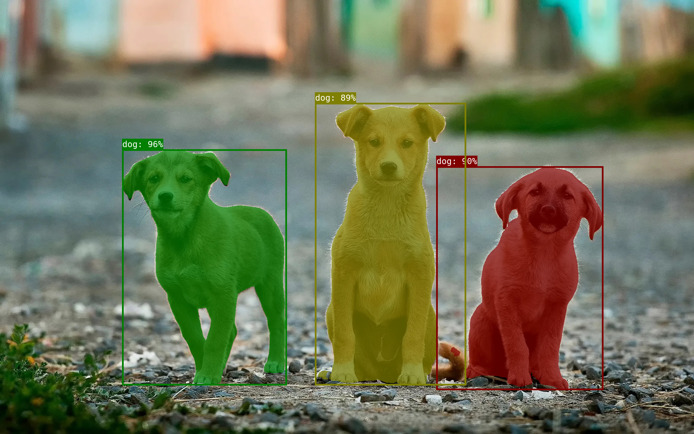
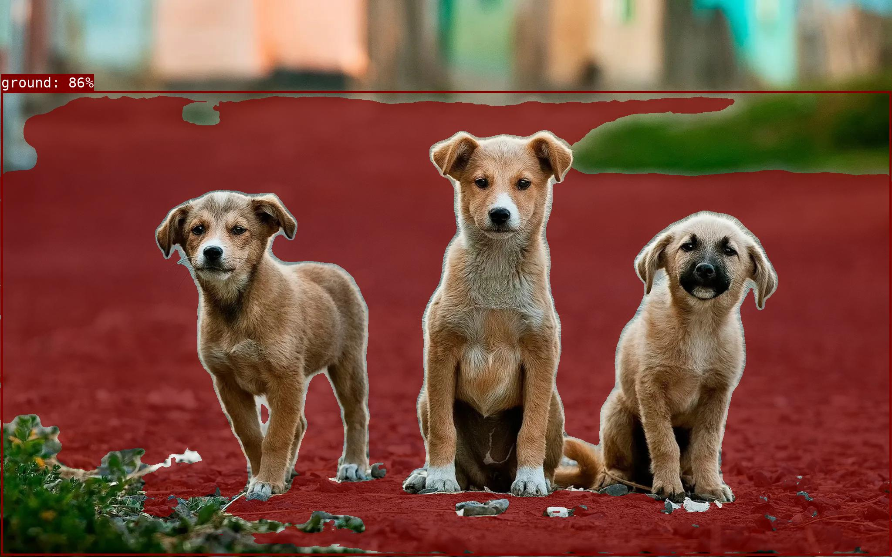

# sam3-onnx

[ONNX](https://onnx.ai/) export and inference for [SAM3](https://github.com/facebookresearch/sam3).

## Installation

```sh
git clone https://github.com/wkentaro/sam3-onnx.git
cd sam3-onnx

curl -LsSf https://astral.sh/uv/install.sh | sh  # install uv

make build  # install deps with uv
```

## Usage

**Inference with pytorch**

```sh
uv run infer_torch.py  # use official sam3 module
# uv run infer_torch.py --image <IMAGE_PATH> --prompt <PROMPT>
```

**Export to onnx**

```sh
uv run export_onnx.py  # creates models/*.onnx
```

**Inference with onnx**

```sh
uv run infer_onnx.py  # use models/*.onnx
# uv run infer_onnx.py --image <IMAGE_PATH> --prompt <PROMPT>
```

## Pre-exported ONNX models

If don't want to export yourself, download them from the [latest release](https://github.com/wkentaro/sam3-onnx/releases/latest).

```
models
├── sam3_decoder.onnx
├── sam3_decoder.onnx.data
├── sam3_image_encoder.onnx
├── sam3_image_encoder.onnx.data
├── sam3_language_encoder.onnx
└── sam3_language_encoder.onnx.data
```

## Examples

```sh
./infer_onnx.py --image images/bus.jpg --prompt person
./infer_onnx.py --image images/bus.jpg --prompt window
```

 

```sh
./infer_onnx.py --image images/sofa.jpg --prompt person
./infer_onnx.py --image images/sofa.jpg --prompt sofa
```

 

```sh
./infer_onnx.py --image images/dog.jpg --prompt dog
./infer_onnx.py --image images/dog.jpg --prompt ground
```

 
